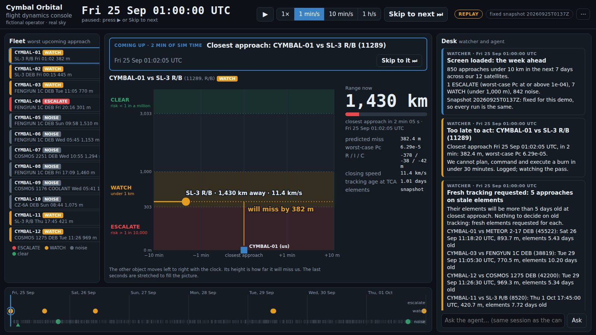
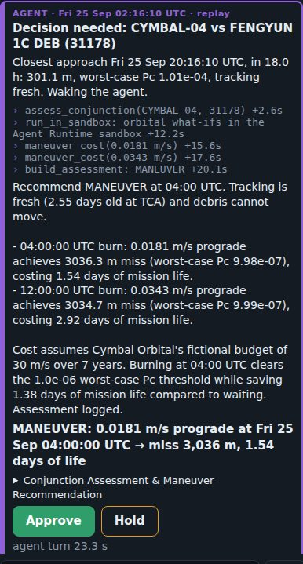
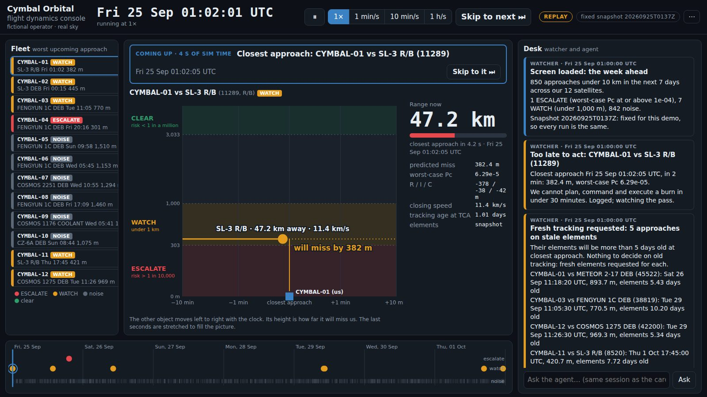
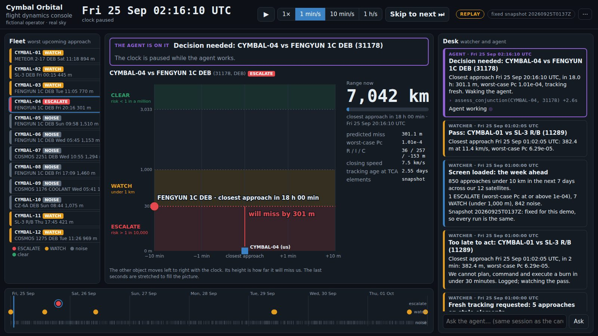
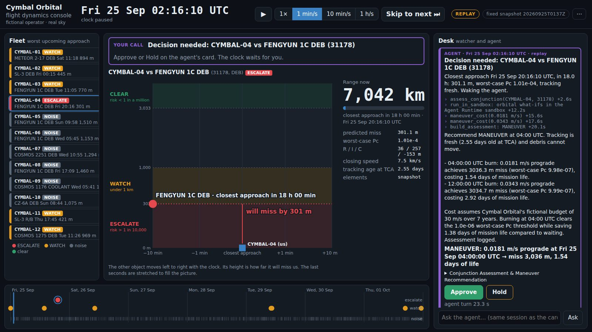
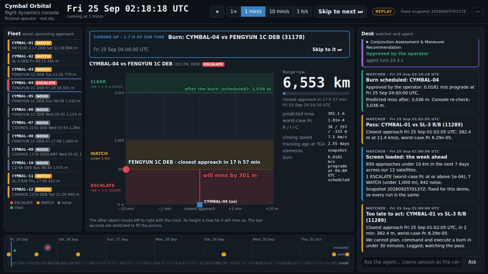
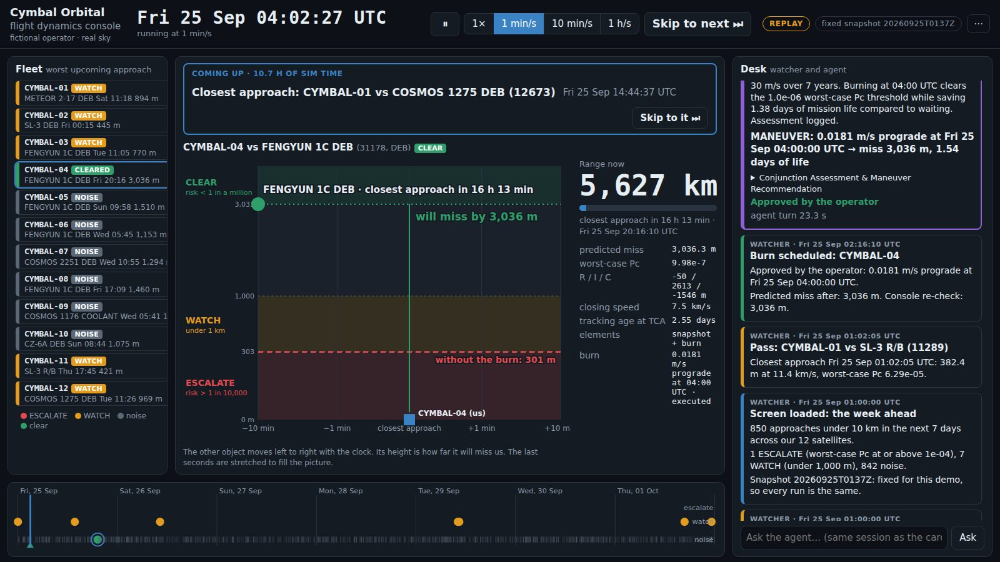
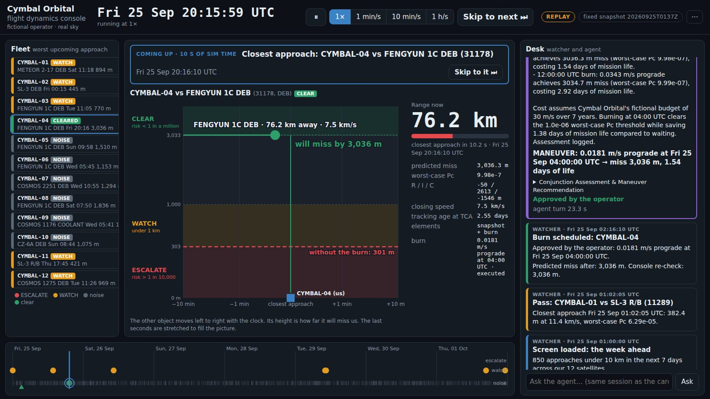
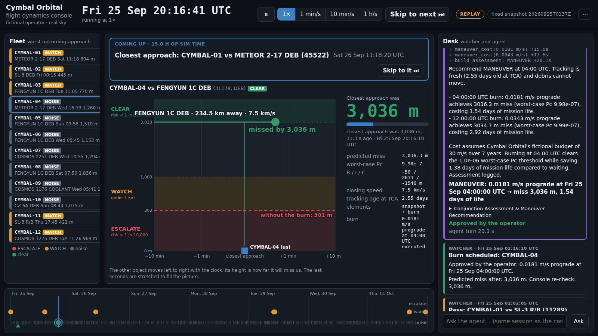
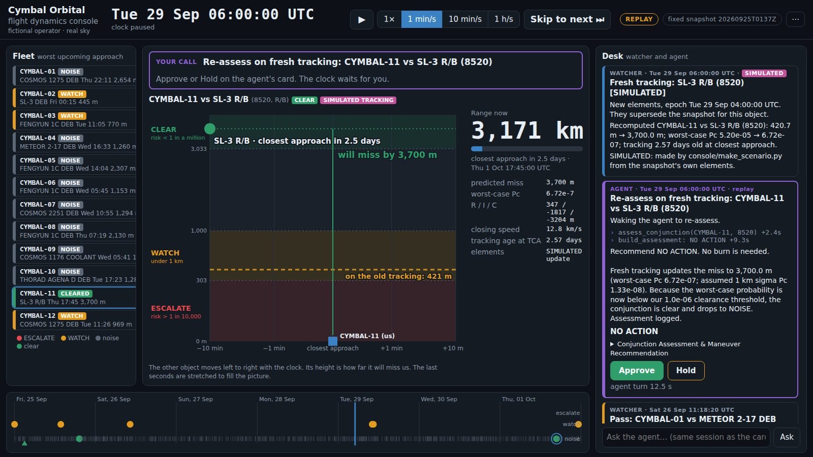

# Instructor guide: the flight dynamics console

**For whoever presents the kickoff demo.** This is step 6 of the run-of-show: the finished product, a
flight dynamics console for a made-up satellite operator. Read this the night before, run the console in
replay beside it, and say the lines out loud once. On the day, the [teleprompter](TELEPROMPTER.md) has
everything you need on one page; this guide is the why behind it.

You don't need to be a space person. You need to understand four ideas, and this guide gives you all four:

1. [How it would run for real](#how-it-would-run-for-real), and why the agent is woken 18 hours out
2. [What Skip to next does](#what-skip-to-next-does)
3. [How to read the picture](#reading-the-picture)
4. [What the agent did on its card](#inside-the-agent-card)

Then [the walkthrough](#the-walkthrough-seven-presses) is eight beats, each with what to press, what to
point at, what to say and why the room should care. [Questions you'll get](#questions-youll-get) is at the end.

---

## The idea in one breath

Twelve satellites (made up), about 32,000 real tracked objects around them, 850 close approaches this
week, and almost all of them are noise. The console runs that week fast. Plain code watches for anything
that matters. When something needs a decision, it wakes the agent. The agent works the problem the way a
flight dynamics engineer would, recommends, and waits. A human says go.

**What makes it impressive is the division of labour.** Point at it more than once:

| | Who | What it does |
|---|---|---|
| **The watcher** | Plain code, no AI | Deterministic rules decide *when* something deserves attention. Cheap, fast, predictable. |
| **The agent** | Gemini, through ADK | Decides *what to do*: is the tracking good enough, what's the cheapest fix, what does it cost. The physics runs in tools, never in the model. |
| **The human** | You, pressing Approve | Nothing happens until someone approves. The agent recommends; people decide. |

And the ending is the hook: **two alerts, two opposite answers.** On Friday the agent says burn now, while
it's cheap. On Tuesday it says don't spend fuel, the fresh tracking clears it. Same agent. That's judgment,
and it's what the judges will be looking for in the teams' work.

---

## How it would run for real

**The clock at the top is "now", inside the demo.** The console runs over one pinned week, Fri 25 Sep
01:00 UTC to Fri 2 Oct, built from a single snapshot of real tracking. In operations, that clock would
simply be the wall clock.

**It always looks a week ahead.** At any moment the screen shows every close approach in the next seven
days. In real life that week is recomputed every time new tracking arrives, several times a day, so the
window rolls forward with the clock. The demo freezes one snapshot and lets time run through it, which is
why the numbers are the same in every city.

**Nobody watches it.** The watcher is an automated job. It triages each fresh screening and stays quiet
unless a rule fires. When one needs a decision, the agent prepares the case *first*, and then the on-call
engineer is paged. They wake up to a recommendation with its costs, not a raw alarm. Approve and Hold are
the flight director's sign-off. The burn then goes up at the next ground-station contact; the 04:00 and
12:00 command windows in the demo stand in for those contacts.

### Why the agent is woken 18 hours out

CYMBAL-04's problem is on the screen from the very first frame: it's the one red satellite, 301 m from a
piece of debris about 19 hours away. **The system doesn't wake the agent the moment something turns red.**
It waits for the decision point, 18 hours before closest approach, and that's on purpose:

- **Late enough that the tracking is as good as it will get.** Predictions sharpen as the moment
  approaches and new tracking comes in. Decide days out and you may spend fuel on a warning that would have
  cleared itself (that's exactly Tuesday's story).
- **Early enough to still act.** A burn has to be planned, approved, and sent up at a command window.
  The earlier you burn, the smaller (cheaper) the nudge needs to be: on Friday, 04:00 costs half what noon
  does.

So at **02:16 UTC** the watcher wakes the agent. It's 2 a.m. at the operations center, which is exactly why
the agent doing the homework before anyone's pager goes off matters.

The 18 hours is **this demo's rule**, chosen so the story fits in a week. Real operators often start
working a conjunction a day or more out and keep refining as new tracking arrives. If someone in the room
knows the field, say so.

### The demo's rules

All plain code, all in `console/scenario.json`:

| Rule | Value |
|---|---|
| Wake the agent for a decision | 18 hours before closest approach, if the worst case is 1 in 10,000 or worse, the tracking is fresh, and there's still time to act |
| Too late to act | inside 30 minutes: logged, not escalated |
| Stale tracking | elements more than 5 days old at closest approach: ask for fresh tracking instead of deciding |
| Clear | worst case below 1 in a million: a miss of about 3 km (3,033 m) |
| Watch | a miss under 1 km |

**Say it once, early:** "In real life nobody sits and stares at this. It runs on its own and pages someone
when there's a decision to make. When I press Skip, I'm fast-forwarding to the next time the pager would go
off."

---

## What Skip to next does

- **It jumps to just before the next thing in the story:** a decision, fresh tracking, a burn, or the pass
  of an approach the story is about. The banner over the picture always names that next stop, so read it
  before you press. The banner's "Skip to it" button does the same thing.
- **Passes land 20 seconds early at real time (1×),** so the room can watch the range fall. Everything else
  lands one sim-minute early at 1 min/s, so it happens about a second after you press.
- **Nothing is skipped over.** Every rule on the way still fires. Other satellites' routine passes are not
  stops, but their cards still land on the Desk as the clock goes by. You'll see one appear after the burn
  and another on the way to Tuesday. Ignore them.
- **It stops by itself when the agent is woken,** and does nothing while the agent works or waits for
  Approve or Hold.
- **After the story,** Skip goes pass to pass until the end of the week.

**The speed buttons** (1×, 1 min/s, 10 min/s, 1 h/s) are there if you want to let time run; the show never
needs them. After you Approve, the clock runs at 1 min/s, so "closest approach in 18 hours" would take 18
real minutes. Nothing happens in between, and that's the point: Skip. To linger on a fly-by, just don't
press anything once it lands. It's already at real time, the slowest speed.

**In real life there's no Skip.** The hours simply pass, and the system calls you when it needs you.

---

## Reading the picture

- **The clock** (top): simulated time over the pinned week. REPLAY means the agent cards are the
  recording (see [Questions](#questions-youll-get)).
- **Fleet** (left): our twelve satellites, each coloured by its worst approach still to come.
- **Desk** (right): the watcher's cards and the agent's cards, newest on top.
- **Timeline** (bottom): the week. Grey ticks are the hundreds of approaches that don't matter; dots are the
  few worth watching. Click a dot to look at it.
- **The fly-by** (middle): the picture to watch.

**The fly-by.** Left to right is time around closest approach, ten minutes either side, stretched near the
middle so the last seconds get room. Up is how far the object will miss us. We're the blue square at zero.
The bands are the rules: red (under about 303 m, worse than 1 in 10,000: act), amber (under 1 km: watch),
green (over about 3 km, better than 1 in a million: clear). The object's dot slides along its line as the
clock runs: solid behind it, dotted ahead.

**Why the dot never moves up or down as it travels:** its height isn't where the object is now; it's the
*prediction* of how far it will miss us. That only changes when something changes the prediction: the burn
or fresh tracking. That's when you see it jump. Ghost lines keep the old answer on screen: red dashed
"without the burn", amber dashed "on the old tracking", and green dotted "after the burn (scheduled)".

**"Range now" and "missed by" are different numbers.** Range now is the straight-line distance at this
instant. "Missed by" is the closest it ever gets. For CYMBAL-01 and the old rocket body, closing at
11.4 km/s:

| Time to closest approach | 20 s | 10 s | 3 s | 1 s | 0 | +3 s |
|---|---|---|---|---|---|---|
| Range | 227 km | 114 km | 34 km | 11 km | 0.38 km | 34 km |

The screen updates four times a second, about 3 km apart at that speed, so the gauge never shows 382 m. Your
eye catches the numbers climbing again right after. Thirty seconds after the pass, the gauge switches to
"Closest approach was 382 m".

---

## Inside the agent card

**What wakes it.** At Fri 02:16, 18 hours before CYMBAL-04 meets the debris, the watcher's rule fires: worst
case 1 in 10,000, tracking fresh (2.55 days old at closest approach), and time to act. It sends the agent a
short alert, the brief: the facts, the two command windows (04:00 and 12:00), and the playbook to run. The
clock stops.

**The steps, as the recording ran them.** The `+seconds` on each line is when that step finished.

| Step | What it is |
|---|---|
| `assess_conjunction` +2.6 s | **A custom tool we wrote.** It pulls the approach from BigQuery and identifies the object: FENGYUN 1C debris, from the 2007 Chinese anti-satellite test. It makes the calls that need no model: tracking 2.55 days old, so fresh; debris can't dodge. It states the assumptions and stages a case file in the sandbox. |
| `run_in_sandbox` +12.2 s | **The required differentiator.** The agent writes a few lines of Python against our orbit what-if module, and they run in the Agent Runtime code sandbox: isolated, no network. They size the smallest prograde burn at each window that clears the approach: **04:00 → 0.0181 m/s → 3,036 m**; **12:00 → 0.0343 m/s → 3,035 m**. |
| `maneuver_cost` ×2 +15.6 s, +17.6 s | Turns each burn into days of the satellite's life, using a fictional budget of 30 m/s over 7 years: **1.54 days** against **2.92 days**. |
| `build_assessment` +20.1 s | Assembles the write-up. It re-reads the facts from BigQuery itself, so the numbers come from the data, not the model's memory. The agent supplies only the decision, the rationale and the sandbox's numbers. |

The whole turn took 23 seconds.

**Its reasoning, in plain words.** Over the threshold, tracking good enough to trust, and the other object
can't move: so we act. Both windows clear it, but the earlier burn is cheaper, because a small nudge along
the orbit has more hours to grow into distance. 04:00 saves 1.38 days of the satellite's life. Recommend
04:00.

**What's on the card, top to bottom:** the watcher's line (why it was woken) · the steps · the agent's own
words · the bold summary line the console builds from the assessment · the expandable write-up · Approve and
Hold · how long the turn took.

**The expandable write-up** (*Conjunction Assessment & Maneuver Recommendation*) is the output artifact, the
thing a flight director would actually receive:

- **The approach:** who meets what, when, at what speed; the 301 m split into radial, in-track and
  cross-track.
- **Risk:** the worst case (1.0e-04, which needs no assumptions) next to the probability *if* the tracking
  error were 200 m (1.0e-04) or 1 km (1.2e-05), and the tracking age.
- **Recommendation** and **Maneuver:** the burn, the miss after, the cost in days and as a share of the
  budget (0.06%).
- **Assumptions:** 5 m combined size, no covariance in public data, what "clear" means, the fictional budget.
- **What we cannot see:** objects not updated in 30 days weren't screened; public elements can be off by
  kilometres; a real operator would request a conjunction data message, with covariance, before spending
  propellant.
- The data credit: U.S. Space Command via Space-Track, and CelesTrak.

**After Approve,** the "Burn scheduled" card says **Console re-check: 3,036 m.** The console re-ran the
agent's burn with its own code and got the same answer: a second, independent check of the model's number.
Worth one sentence on stage.

**Tuesday's card is short on purpose:** `assess_conjunction` (it sees the fresh, simulated tracking) and
`build_assessment: NO ACTION`, in 12.5 seconds. No sandbox and no costing, because there's nothing to size.
Not running tools it doesn't need is judgment too.

---

## The walkthrough: seven presses

**Skip · Skip · Approve · Skip · Skip · Skip · Approve.** Start in replay with the clock at
Fri 25 Sep 01:00:00 UTC (⋯ ▸ Restart the week if not).

### Beat 1 · The screen at rest

**Press:** nothing yet.

**Point at:** the clock; the Fleet with one red satellite, CYMBAL-04; the top Desk card ("850 approaches …
1 ESCALATE, 7 WATCH, 842 noise"); the timeline's grey ticks and few dots; the fly-by's three bands.

**Say:**
> This is the finished product: a flight dynamics console for our made-up company, Cymbal Orbital. Twelve
> satellites on the left; everything they could hit is real.
>
> The clock up here runs over one week of real tracking data. Eight hundred and fifty close approaches. And
> the very first thing the system tells us is the honest answer: one of those matters.
>
> In real life nobody stares at this. It runs on its own and pages someone when there's a decision. When I
> press Skip, I'm fast-forwarding to the next page.

**Why they care:** every team's first problem is too much data. The screen opens by turning 850 alarms into
one decision. That's value before any AI shows up.

### Beat 2 · Too late to act (Skip)

**Press:** Skip to next. It runs at real time for the last 20 seconds before the pass.

**Point at:** the amber dot travelling toward closest approach; the Range number falling 11 km every
second; then the Desk card "Too late to act".

**Say:**
> Two minutes into the week, CYMBAL-01 passes an old Soviet rocket body at 382 metres. Close, but there's
> nothing to decide: you can't plan and fire a burn in two minutes.
>
> Notice who handled that: not the AI. Plain code saw it, logged it, and moved on. You don't spend a model
> call on something with no decision in it.

**Why they care:** restraint. Teams will be tempted to send everything to Gemini. The best designs use the
model only where judgment is needed.

### Beat 3 · The agent is woken (Skip)

**Press:** Skip to next. The clock jumps to 02:16 and stops by itself.

**Point at:** the banner, "THE AGENT IS ON IT"; then each step as it appears on the purple card.

**Say:**
> Two in the morning. Eighteen hours before CYMBAL-04 meets a piece of Chinese anti-satellite debris at 300
> metres, the watcher wakes the agent. Why eighteen hours? The tracking is about as good as it's going to
> get, and there's still time to fit a burn in. And the clock stops: time doesn't run while the desk decides.
>
> Watch what it does. First it assesses the approach: is the tracking fresh enough to trust, can the other
> object move? Then it sizes a burn at two different times, in a code sandbox. Then it prices each one in
> days of the satellite's life. Then it writes it up. That's the playbook a flight dynamics engineer would
> run, done before anyone's pager goes off.

**Why they care:** this is the "why an agent" moment. A script gives you a miss distance; an agent works out
what to do about it. The steps on the card are the kind of thing the teams will build: custom Python tools over
BigQuery data, and (this demo's required differentiator) the code sandbox.

### Beat 4 · Your call

**Press:** nothing yet. Let the room read it.

**Point at:** the bold line: MANEUVER, 0.0181 m/s at 04:00, miss 3,036 m, 1.54 days of life. Then the two
buttons.

**Say:**
> Here's the recommendation: a tiny nudge, less than two centimetres a second, at four in the morning. It
> moves the miss from 300 metres to three kilometres.
>
> Why four and not noon? Burning earlier is cheaper: at noon it would take twice the fuel. It costs about a
> day and a half of the satellite's seven-year life.
>
> And now it waits. The agent recommends. I decide.

**Why they care:** human in the loop, made concrete. Their agents will propose actions too; showing who holds
the authority is part of a credible design.

### Beat 5 · Approve

**Press:** Approve.

**Point at:** the red dot still in the red band (today's prediction) and the new dotted green line (after the
burn, scheduled). The "Burn scheduled" card's "Console re-check: 3,036 m".

**Say:**
> Approved. The red dot is where it passes us today. That dotted green line is where it will pass once the
> burn fires at four. And the console checked the agent's number with its own code: same answer.

**Then:** the clock runs again at 1 min/s. Don't wait; go straight to Beat 6.

**Why they care:** the decision has a visible consequence before it happens, and a second check before
anything is spent.

### Beat 6 · The burn and the fly-by (Skip, Skip)

**Press:** Skip to next: the clock jumps to just before 04:00 and the burn fires. A green "Burn executed"
card; the dot jumps up onto the green line, and a red dashed line stays behind at 301 m.

**Say:**
> Four a.m.: the burn fires. Watch the dot jump: that's the prediction moving from three hundred metres to
> three kilometres. The burn changes the satellite's speed by under two centimetres a second, and sixteen
> hours of orbit turn that into three kilometres.

**Press:** Skip to next: the clock jumps to 20 seconds before CYMBAL-04's pass and runs at real time. Then
hands off. (Another satellite's routine pass leaves its card on the Desk on the way. Ignore it.)

**Point at:** the Range counting down; the debris on the green line; the red dashed "without the burn:
301 m"; "will miss by 3,036 m".

**Say:**
> Sixteen hours later. That's the debris coming in at seven and a half kilometres a second. The red dashed
> line is the world where we did nothing: three hundred metres. The green line is the world we chose.
>
> [after it passes] Three kilometres. A day and a half of the satellite's life bought that.

**Why they care:** the payoff of the decision, in one picture anyone can read. Let the room watch the last
ten seconds in silence.

### Beat 7 · Tuesday: the right answer is don't burn (Skip, then Approve)

**Press:** Skip to next: straight to Tuesday 06:00 (Saturday's routine pass leaves its card on the way).
Wait for YOUR CALL, then Approve.

**Point at:** the pink SIMULATED TRACKING tag; the amber dashed "on the old tracking: 421 m"; the dot now up
in the green band; the agent's short card: NO ACTION.

**Say:**
> Remember the card at the very start, "fresh tracking requested"? This rocket body was 420 metres away on
> Thursday. But the tracking was a week old, so instead of spending fuel on a guess, we asked for better data.
>
> Tuesday, the fresh tracking arrives. This part is simulated; the snapshot has no future, and it says so
> right there. The new prediction is three point seven kilometres.
>
> The agent re-assesses and says: do nothing. Same agent as Friday, opposite answer. That's judgment.

**Why they care:** any system can say "act". Saying "don't act, and here's why" is harder and more valuable.
This is the moment that separates an agent from an alarm.

### Beat 8 · Close: the write-up

**Press:** on CYMBAL-04's agent card, open *Conjunction Assessment & Maneuver Recommendation*.

**Point at:** the Risk line (worst case next to the assumed numbers) and "What we cannot see".

**Say:**
> Last thing. Look at how it writes it up. The worst case, which needs no assumptions, sits next to the
> number under an assumed uncertainty. And there's a section called "what we cannot see".
>
> One more honest detail: the cards you just watched are a recording of a real run of this agent, played
> back so a demo on conference wifi behaves the same every time. Steal that trick for your own demo.
>
> That's the bar: every number from a tool, every assumption stated. Now go build yours.

**Why they care:** "rigor and judgment" is on their scoring sheet. This is what it looks like on paper.

---

## Questions you'll get

**Is the AI doing the orbital physics?** No. The physics is SGP4, the standard propagator, and a small
what-if module in the code sandbox. The model decides which questions to ask, writes a few lines of code to
call that module, and reads the answers.

**Is this real data?** The 32,000 objects and their tracking are real, from U.S. Space Command via
Space-Track, pinned to one snapshot so every city sees the same numbers. The twelve satellites are made up,
and Tuesday's fresh tracking is simulated (labelled wherever it appears).

**Why not just write a script?** A script can compute a miss distance. Deciding whether the tracking is good
enough to act on, when to burn, what it costs, and when not to act at all is judgment: that's the agent's
job.

**Is that a recording?** The console's agent cards, yes: a real run of this agent (Gemini, the sandbox,
BigQuery), replayed at the same moments. The same agent answers live in the ADK web UI in step 3. The
recording is `console/recordings/rehearsal.json`; [the planning guide](PLANNING-GUIDE.md) shows how to make a
new one.

**Does someone sit and watch this all day?** No. The watcher runs whenever new tracking arrives and pages the
on-call engineer only when there's a decision. What you saw in ten minutes is a week of pages.

**Why 18 hours?** Late enough that the tracking is as good as it will get, early enough to plan a burn and
burn early (cheaply). It's this demo's rule; real desks often start a day or more out and keep refining.

**Why did the range say 42 km if it missed by 382 m?** Range is the distance at this instant; "missed by" is
the closest it got. At 11 km a second, the last 42 km takes under four seconds.

**Why doesn't the dot move up and down?** Its height is the prediction of the miss, not where the object is
now. It moves when the prediction changes: at the burn, and when fresh tracking arrives.

**Why does the clock stop?** So a decision can't silently run out of time while the agent thinks or a human
reads. The clock you care about is the burn window.

**What's the 1 in 10,000?** The worst-case collision probability: the highest it could be, whatever the
tracking error. It needs no assumptions, which is why it leads.
